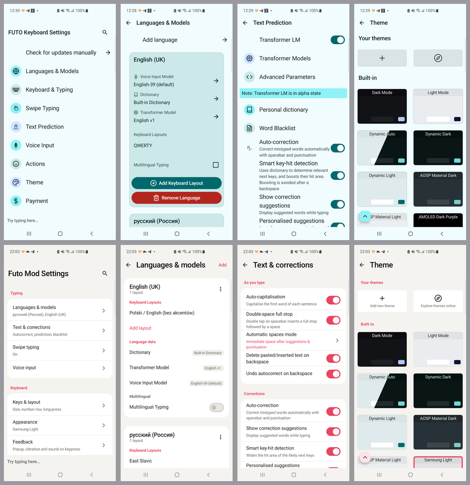
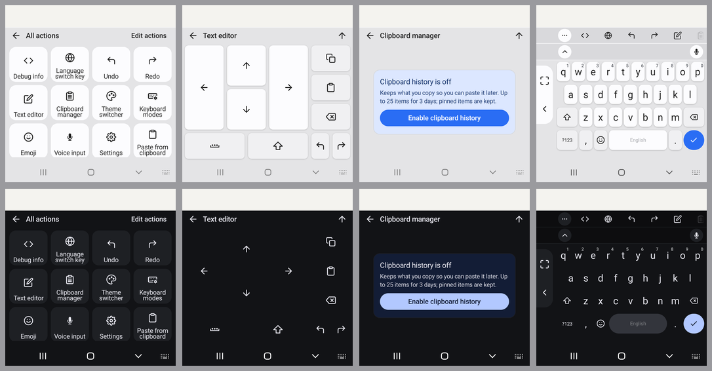

# FUTO Keyboard — Kirkouski fork

A personal fork of [futo-org/android-keyboard](https://github.com/futo-org/android-keyboard),
carrying Polish and Cyrillic typographic layouts, a Samsung-style theme, and a
handful of upstream fixes that have not landed yet.

It installs as **Futo Mod**, alongside a released FUTO Keyboard rather than
replacing it: the `kirkouski` flavor has its own applicationId, and update
checking is off, because an "update" would swap this build for an upstream
release and drop every patch below.

Upstream's own README follows [under the divider](#futo-keyboard).

## Differences from upstream

### Four keyboard layouts


Polish and Cyrillic letters sit behind the base letter you already reach for —
hold `a` for `ą`, `z` for `ż`. Nothing is relearned and no key is given up.

|  | with accents | without |
| --- | --- | --- |
| Latin | `Polski / English (typograficzna)` | `Polski / English (bez akcentów)` |
| Cyrillic | `Кириллица (типографская)` | `Кириллица (без диакритики)` |

The typographic builds add a page of ten dead keys plus the spaces and hyphens no
stock symbols page has — non-breaking, narrow non-breaking, thin, soft hyphen,
non-breaking hyphen. It costs the `⁜` key; the plain builds give that width back
to the spacebar.

Cyrillic is offered on Russian, Belarusian and Ukrainian here. Upstream holds the
last two back until
[#2268](https://github.com/futo-org/android-keyboard/issues/2268) lands, which
this tree carries.

Generated from [polish-typographic.com](https://polish-typographic.com), proposed
upstream as [#309](https://github.com/futo-org/futo-keyboard-layouts/pull/309)
and [#310](https://github.com/futo-org/futo-keyboard-layouts/pull/310).

### A Samsung-style theme


Keys had never cast a shadow — a drawable cannot paint outside its own bounds.
These do, into the gap that already sits between keys, so hit targets and gesture
typing are untouched. Opt-in: every other theme renders exactly as before.

### The settings app, rebuilt



The same four screens on the same phone: shipped 0.1.30 above, this fork below.

Settings used to render in whichever *keyboard* theme was selected — which is why
the top row is cyan, and why capturing 0.1.30 with the system in light and again
in dark gives two pixel-identical images. They follow the system now.

Rows group into cards under section headers instead of running as one flat list,
each carrying its own state as a subtitle, in sentence case, without a circled
icon repeating what the label already says. Developer screens are left alone on
purpose. Component kit:
[`docs/settings-ui-kit.html`](docs/settings-ui-kit.html).

### The keyboard's own panels



Everything the keyboard draws over your app — actions, emoji, clipboard, themes,
modes, the text editor — had never been looked at. Both rows are the same four
panels on two deliberately unlike themes.

- All actions fits twelve tiles in one view instead of cutting the last row
  through its labels.
- The theme panel shows themes, instead of opening with every thumbnail below the
  fold.
- The text editor is built from the keyboard's own keys, so it follows the theme
  down to key borders being turned off.
- The emoji page is on one spacing scale, and search moved onto the panel.
- Lists that can be empty say so. The clipboard stopped shipping a fake pinned
  entry reading "Clipboard entries will appear here".
- Panels have titles, clear-recents stopped wearing the dismiss icon, and what is
  selected is shown one way rather than five.

### Smaller changes

- The one-handed controls sit together in one container, and the exit button
  moved out of the arc a thumb sweeps while typing one-handed. It can be hidden.
- Background images can be blurred, not only dimmed.

### Upstream fixes carried here

Filed upstream, merged here rather than waited on.

| Issue | What it fixes |
| --- | --- |
| [#2262](https://github.com/futo-org/android-keyboard/issues/2262) | Autocorrect scored every letter after the first non-ASCII one against the wrong tap — exactly the Polish and Cyrillic case this fork exists for. |
| [#2263](https://github.com/futo-org/android-keyboard/issues/2263) | Quick actions land on the wrong key on every ЙЦУКЕН layout, including the standard Russian one. In the shipped release. |
| [#2265](https://github.com/futo-org/android-keyboard/issues/2265) | A model covering two languages showed `en pl` as its heading. |
| [#2266](https://github.com/futo-org/android-keyboard/issues/2266) | A fresh clone did not build on a default Windows install. |
| [#2267](https://github.com/futo-org/android-keyboard/issues/2267) | Adding a second product flavor failed Gradle configuration. |
| [#2268](https://github.com/futo-org/android-keyboard/issues/2268) | Every Cyrillic layout failed to load on every locale but `ru`. |

### Installing a build

APKs are attached to this fork's
[releases](https://github.com/AndrewKirkovski/android-keyboard/releases). They
install alongside an official FUTO Keyboard rather than replacing it.

They are **not** signed with FUTO's key, and the fingerprints under
[APK signing](#apk-signing) are FUTO's — they will not match anything here. From
`0.1.30-kirkouski.3` on, this fork signs with its own key:

```
CN=Futo Mod, OU=Kirkouski Fork, O=Andrei Kirkouski, C=PL
SHA-256: 89:CF:20:B5:7C:D0:4F:0E:DA:48:A6:EF:91:D9:3D:FE:03:45:47:62:2A:D6:FF:55:C0:00:73:71:2B:9F:D9:ED
```

Check it with `apksigner verify --print-certs <apk>`. It says the APK came from
whoever holds that key and has not been altered since; it is self-signed, so it
vouches for continuity between releases, not for an identity anyone else has
verified. Build it yourself if that matters.

Releases up to `0.1.30-kirkouski.2` carried the Android SDK's debug certificate
(`CN=Android`), whose private half ships with every SDK install and identifies
nobody. **Android will not upgrade across that change**: uninstall an earlier
build before installing `.3`, which loses this keyboard's settings.

### Building this fork

As upstream, but the flavor is `kirkouski`:

```
./gradlew assembleKirkouskiDebug
```

The layouts submodule points at
[AndrewKirkovski/futo-keyboard-layouts](https://github.com/AndrewKirkovski/futo-keyboard-layouts)
on `feat/kirkouski-typographic`, which carries all four layouts and their
`mapping.yaml` rows. A recursive clone gets them; a plain clone gets a keyboard
without them.

`master` mirrors `upstream/master` and is never committed to. Everything above
lives on `my-main`.

---

# FUTO Keyboard

The goal is to make a good modern keyboard that stays offline and doesn't spy on you. This keyboard is a fork of [LatinIME, The Android Open-Source Keyboard](https://android.googlesource.com/platform/packages/inputmethods/LatinIME), with significant changes made to it.

Check out the [FUTO Keyboard website](https://keyboard.futo.tech/) for downloads and more information.

The code is licensed under the [FUTO Source First License 1.1](LICENSE.md).

## Issue tracking and contributing

Please check the GitHub repository to report issues: [https://github.com/futo-org/android-keyboard/](https://github.com/futo-org/android-keyboard/)

The source code is hosted on our [internal GitLab](https://gitlab.futo.org/keyboard/latinime) and mirrored to [GitHub](https://github.com/futo-org/android-keyboard/). As registration is closed on our internal GitLab, we use GitHub instead for issues and pull requests.

Due to custom license, pull requests to this repository require signing a [CLA](https://cla.futo.org/) which you can do after opening a PR. Contributions to the [layouts repo](https://github.com/futo-org/futo-keyboard-layouts) don't require CLA as they're Apache-2.0

If you want to help translate the app, please do so via our Pontoon instance: https://i18n-keyboard.futo.org/

## Layouts

If you want to contribute layouts, check out the [layouts repo](https://github.com/futo-org/futo-keyboard-layouts).

## Building

When cloning the repository, you must perform a recursive clone to fetch all dependencies:
```
git clone --recursive https://gitlab.futo.org/keyboard/latinime.git
```

If you forgot to specify recursive clone, use this to fetch submodules:
```
git submodule update --init --recursive
```

You can then open the project in Android Studio and build it that way, or use gradle commands:
```
./gradlew assembleUnstableDebug
./gradlew assembleStableRelease
```

## APK signing

For official FUTO Keyboard versions, you can verify the APK's signing key fingerprint for integrity.

```
Signing key fingerprint for all versions except Google Play:

MD5: 3A:BB:71:C6:BB:E4:92:27:B1:E3:5D:81:01:48:6A:B0
SHA1: 5D:15:B3:6E:C9:6A:96:28:41:09:DD:62:93:0D:9C:39:9F:5F:06:43
SHA-256: 74:3F:AD:58:64:AB:C4:26:50:0B:2D:C2:C4:7C:8A:D3:24:CB:CD:16:03:3F:80:16:99:48:41:35:63:74:F9:95

```
