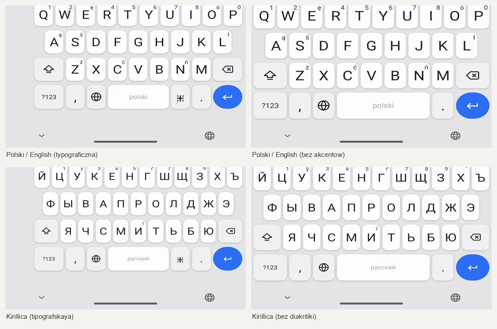
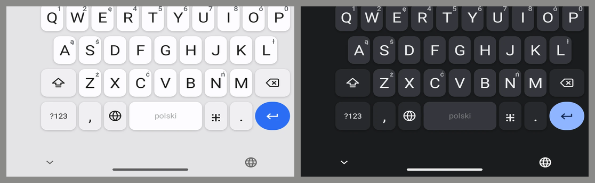

# FUTO Keyboard — Kirkouski fork

A personal fork of [futo-org/android-keyboard](https://github.com/futo-org/android-keyboard),
carrying Polish and Cyrillic typographic layouts, a Samsung-style theme, and a
handful of upstream fixes that have not landed yet.

It installs alongside a released FUTO Keyboard rather than replacing it: the
`kirkouski` flavor has its own applicationId, and update checking is off, because
an "update" would swap this build for an upstream release and drop every patch
below.

Upstream's own README follows [under the divider](#futo-keyboard).

## Differences from upstream

### Four keyboard layouts



Two languages, each in two builds. Polish and Cyrillic letters sit behind the
base letter you would reach for — hold `a` for `ą`, `z` for `ż` — so nothing is
relearned and no key is given up.

|  | with accents | without |
| --- | --- | --- |
| Latin | `Polski / English (typograficzna)` | `Polski / English (bez akcentów)` |
| Cyrillic | `Кириллица (типографская)` | `Кириллица (без диакритики)` |

The typographic builds add one extra page holding ten dead keys and the
characters no stock symbols page has — the non-breaking space, the narrow
non-breaking space, the thin space, the soft hyphen and the non-breaking hyphen
appear nowhere else in the layouts repository. That page costs the `⁜` key in the
bottom row; the plain builds give the width back to the spacebar, which is the
only visible difference between the two.

The Cyrillic pair is offered on Russian, Belarusian and Ukrainian here. Upstream
holds the latter two back until
[#2268](https://github.com/futo-org/android-keyboard/issues/2268) lands; this
tree carries that fix.

Generated from the desktop layouts at
[polish-typographic.com](https://polish-typographic.com); the two typographic
ones are proposed upstream as
[#309](https://github.com/futo-org/futo-keyboard-layouts/pull/309) and
[#310](https://github.com/futo-org/futo-keyboard-layouts/pull/310).

### A Samsung-style theme, with real key shadows



Keys had never cast a shadow. `KeyboardView.onDrawKeyBackground` sets a
`GradientDrawable`'s bounds to exactly the key rect, and a drawable cannot paint
outside its own bounds, so there was nowhere for one to go.

`ShadowedRoundRectDrawable` uses the hook that already existed: that method calls
`background.getPadding()` and expands the draw rect by it. The shadow renders
once into a bitmap and is blitted, because `KeyboardView` runs on a hardware
layer where `setShadowLayer` is ignored on many API levels. It paints into the
4dp/8dp gap that already exists between keys rather than widening it, since that
gap also feeds `Key.hitBox`, `KeyDetector` and gesture typing.

Opt-in throughout: `AdvancedThemeOptions.keyShadow` defaults to null and every
other theme renders exactly as before.

### Settings that follow the system theme

The settings screens used to render in whichever *keyboard* theme was selected —
a palette tuned for a 360dp strip over someone else's app, asked to carry a
full-screen scrolling surface. Dark mode was not a mode but eighteen arbitrary
palettes recoloured.

They now follow the system light/dark setting like any other app, with the
product's own palette. The keyboard theme stays where it belongs: on the
keyboard, and on the previews of it that settings screens show.

A fuller redesign is in progress. Its component kit lives at
[`docs/settings-ui-kit.html`](docs/settings-ui-kit.html) — open it in a browser
beside the app. It is the target the Compose work is measured against, in both
light and dark, with every entry naming the composable and file it maps to and
carrying the measurement it replaces.

### The keyboard's own panels

The settings redesign stopped at the app boundary. Everything the keyboard draws
over someone else's app — all actions, emoji, clipboard, themes, keyboard modes,
the one-handed control — had never been looked at. Each of the below was found by
opening the panel on a phone at 1080px rather than by reading the code.

- **All actions holds twelve tiles in one view.** `GridCells.Adaptive(98.dp)`
  yields three columns at 411dp, so twelve actions needed four rows where the
  panel has room for two and a half, and the last row was cut through its labels.
  It is `Fixed(4)` now, and the label is laid out at the tile's width rather than
  shrink-wrapped inside a narrower column — which is why "Language switch key"
  used to break mid-word while the longer "Clipboard manager" did not.
- **The theme panel shows themes.** It reused the settings screen's picker
  unchanged. "Your themes", its two buttons and a heading are together taller than
  the strip the panel gets above the keyboard, so every built-in thumbnail began
  below the fold and the panel opened with no theme in sight.
- **The emoji page is on one spacing scale.** It had four different horizontal
  insets down it. Emoji were drawn at 40dp in a 42dp cell:
  `emoji_picker_emoji_view_padding` is what sets that, since `EmojiView` scales
  the glyph to fill whatever the cell leaves, and the text size only decides the
  resolution it is rendered at. Search moved off a fixed 128dp pill in the window
  bar and onto the panel, where it has width and sits with what it filters.
- **Clear-recents is not an X.** It wore `R.drawable.close` a few pixels from the
  back arrow that closes the panel, so the destructive control had the dismiss
  icon and the dismiss control sat beside it.
- **Sentence case reached the panels.** They still said "Clipboard History
  Inactive" above a button reading "Enable Clipboard History", from a keyboard
  whose settings rows had already stopped doing that.
- **Keyboard modes says which screen it is.** The shared window bar is only drawn
  when the keyboard is hidden, and this panel keeps it visible, so the screen had
  a back arrow and a Resize keyboard button with nothing between them.

### Smaller changes

- **The one-handed control is one control.** The switch-hands chevron sat at the
  top of the empty gutter and the exit button at the bottom, both bare glyphs
  next to a mic button that has a container. They now share one, centred in the
  gutter, square against the screen edge it touches and rounded on the inner
  side, with 20dp between two buttons that mean "nudge the keyboard across" and
  "leave one-handed mode".
- **Hide the one-handed exit button.** It sits inside the arc a thumb sweeps
  while typing one-handed, so it gets caught by accident. A setting under
  Keyboard → Resize hides it, and a long press on the switch-hands chevron
  leaves one-handed mode.
- **Background images can be blurred.** Opacity was already a theme-file field;
  sharpness was not. `AdvancedThemeOptions.backgroundImageBlur` defaults to 0dp.

### Upstream fixes carried here

Each is filed upstream and merged into this tree rather than waited on.

| Issue | What it fixes |
| --- | --- |
| [#2262](https://github.com/futo-org/android-keyboard/issues/2262) | Autocorrect indexed compose coordinates by UTF-8 byte, so every letter after the first non-ASCII one was scored against the wrong tap. Exactly the Polish and Cyrillic case this fork exists for. |
| [#2263](https://github.com/futo-org/android-keyboard/issues/2263) | Quick actions land one key off on any layout whose third letter row is nine columns or more — which is every ЙЦУКЕН layout, in the shipped release. |
| [#2265](https://github.com/futo-org/android-keyboard/issues/2265) | A model covering two languages showed `en pl` as its heading. |
| [#2266](https://github.com/futo-org/android-keyboard/issues/2266) | `generate.py` opened its inputs without an encoding, so a fresh clone did not build on a default Windows install. |
| [#2267](https://github.com/futo-org/android-keyboard/issues/2267) | Adding a second product flavor failed Gradle configuration. |
| [#2268](https://github.com/futo-org/android-keyboard/issues/2268) | Every Cyrillic layout failed to load on every locale but `ru`. |

### Building this fork

As upstream, but the flavor is `kirkouski`:

```
./gradlew assembleKirkouskiDebug
```

The layouts submodule points at
[AndrewKirkovski/futo-keyboard-layouts](https://github.com/AndrewKirkovski/futo-keyboard-layouts)
on `feat/kirkouski-typographic`, which carries all four layouts and their
`mapping.yaml` rows. A recursive clone gets them; a plain clone gets a keyboard
without them.

`master` mirrors `upstream/master` and is never committed to. Everything above
lives on `my-main`.

---

# FUTO Keyboard

The goal is to make a good modern keyboard that stays offline and doesn't spy on you. This keyboard is a fork of [LatinIME, The Android Open-Source Keyboard](https://android.googlesource.com/platform/packages/inputmethods/LatinIME), with significant changes made to it.

Check out the [FUTO Keyboard website](https://keyboard.futo.tech/) for downloads and more information.

The code is licensed under the [FUTO Source First License 1.1](LICENSE.md).

## Issue tracking and contributing

Please check the GitHub repository to report issues: [https://github.com/futo-org/android-keyboard/](https://github.com/futo-org/android-keyboard/)

The source code is hosted on our [internal GitLab](https://gitlab.futo.org/keyboard/latinime) and mirrored to [GitHub](https://github.com/futo-org/android-keyboard/). As registration is closed on our internal GitLab, we use GitHub instead for issues and pull requests.

Due to custom license, pull requests to this repository require signing a [CLA](https://cla.futo.org/) which you can do after opening a PR. Contributions to the [layouts repo](https://github.com/futo-org/futo-keyboard-layouts) don't require CLA as they're Apache-2.0

If you want to help translate the app, please do so via our Pontoon instance: https://i18n-keyboard.futo.org/

## Layouts

If you want to contribute layouts, check out the [layouts repo](https://github.com/futo-org/futo-keyboard-layouts).

## Building

When cloning the repository, you must perform a recursive clone to fetch all dependencies:
```
git clone --recursive https://gitlab.futo.org/keyboard/latinime.git
```

If you forgot to specify recursive clone, use this to fetch submodules:
```
git submodule update --init --recursive
```

You can then open the project in Android Studio and build it that way, or use gradle commands:
```
./gradlew assembleUnstableDebug
./gradlew assembleStableRelease
```

## APK signing

For official FUTO Keyboard versions, you can verify the APK's signing key fingerprint for integrity.

```
Signing key fingerprint for all versions except Google Play:

MD5: 3A:BB:71:C6:BB:E4:92:27:B1:E3:5D:81:01:48:6A:B0
SHA1: 5D:15:B3:6E:C9:6A:96:28:41:09:DD:62:93:0D:9C:39:9F:5F:06:43
SHA-256: 74:3F:AD:58:64:AB:C4:26:50:0B:2D:C2:C4:7C:8A:D3:24:CB:CD:16:03:3F:80:16:99:48:41:35:63:74:F9:95

```
